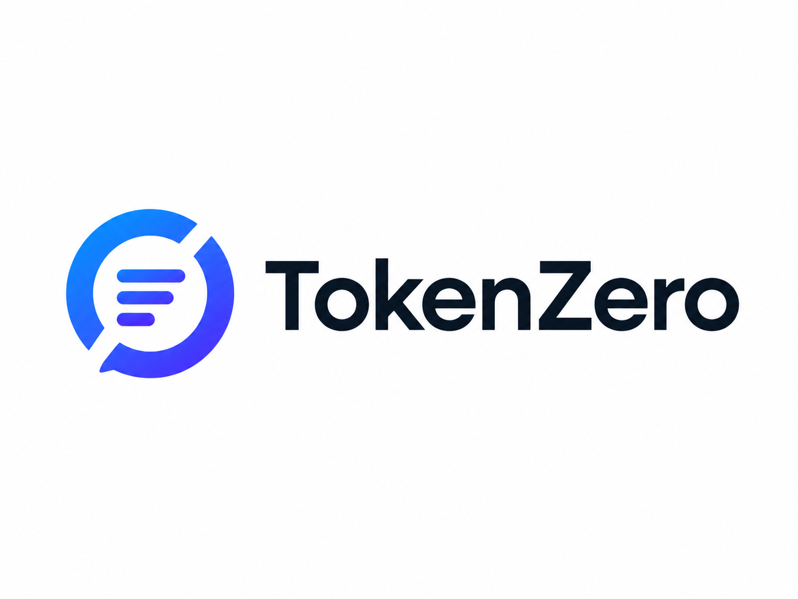

# TokenZero

**Local context optimizer for Claude Code and LLM workflows.**

TokenZero is a small CLI and library that compresses and prepares context — files, logs, JSON, markdown, project trees — before you send it to Claude Code or any other LLM tool. It works **entirely locally** with no API keys.

<picture>
  <source media="(prefers-color-scheme: dark)" srcset=".github/assets/tokenzero-dark.png">
  
</picture>

## Why it exists

Sending raw project context to LLMs wastes tokens on whitespace, repeated lines, verbose JSON, lock files, binaries, and irrelevant directories. TokenZero strips that out safely so what reaches the model is smaller and clearer.

## What it does

- Packs a directory tree into one compact context file
- Compresses markdown and plain text without touching code blocks, URLs, or identifiers
- Converts JSON arrays of uniform objects into compact table format
- Analyzes a project and reports estimated savings
- Optionally installs a Claude Code skill so the workflow is one command away

## What it does not do

- It is **not** a Claude API wrapper.
- It does **not** bypass billing or modify Claude Code internals.
- It does **not** require any API keys (Anthropic, OpenAI, or otherwise).
- It does **not** call external LLM services.

TokenZero only prepares smaller local context. You still send it to Claude Code or your LLM of choice the same way you always do.

## Installation

Run on demand with no install:

```bash
npx tokenzero <command>
```

Or add to a project:

```bash
npm install -D tokenzero
```

## CLI usage

### `tokenzero init`

Creates `.tokenzero/config.json` and `.tokenzeroignore`. If a `.claude/` folder exists, or you pass `--claude-code`, also creates `.claude/skills/tokenzero/SKILL.md`.

```bash
npx tokenzero init
npx tokenzero init --claude-code
```

### `tokenzero pack <paths...>`

Reads files and folders, applies ignore rules, and emits one compact context file.

```bash
npx tokenzero pack . --out .tokenzero/context.md
```

Flags:

- `--out <path>` write to a file (otherwise stdout)
- `--max-bytes <n>` skip files larger than `n` bytes (default 524288)
- `--allow-large` include large files anyway
- `--no-text` skip markdown/text whitespace compression
- `--no-json` skip JSON compression

The command prints a report with before size, after size, and approximate savings.

### `tokenzero compress <file>`

Compresses a single text or markdown file safely. Code blocks, URLs, emails, numbers, dates, and identifiers are preserved.

```bash
npx tokenzero compress prompt.md
npx tokenzero compress prompt.md --out compressed.md
```

### `tokenzero json <file>`

Converts a JSON array of uniform objects into a compact table when safe; otherwise emits compact JSON.

```bash
npx tokenzero json data.json
```

Input:

```json
[
  { "name": "Project Alpha", "status": "active",  "owner": "Alice", "priority": "high" },
  { "name": "Project Beta",  "status": "paused",  "owner": "Bob",   "priority": "medium" }
]
```

Output:

```txt
cols: name | status | owner | priority
Project Alpha | active | Alice | high
Project Beta | paused | Bob | medium
```

### `tokenzero analyze <paths...>`

Prints a report: total files scanned, included, ignored, biggest files, JSON files that can be table-compressed, recommended exclusions, and estimated character savings.

```bash
npx tokenzero analyze .
```

### `tokenzero proxy`

Runs a local Anthropic-compatible proxy that compresses outgoing messages before forwarding them to `https://api.anthropic.com`. Your API key never leaves the request — TokenZero only forwards headers as-is. Nothing is logged or persisted.

```bash
npx tokenzero proxy
# tokenzero proxy listening on http://127.0.0.1:3000
```

Then point any Anthropic SDK or CLI at the proxy:

```bash
export ANTHROPIC_BASE_URL=http://127.0.0.1:3000
claude   # or any tool using the official Anthropic SDK
```

Every `POST /v1/messages` request is intercepted, its `system` and `messages[].content` text fields are whitespace-compressed (code blocks, URLs, identifiers preserved), then forwarded. Streaming responses, tool use, and image blocks pass through untouched.

Flags:

- `-p, --port <n>` port to listen on (default 3000)
- `--host <host>` host to bind (default 127.0.0.1)
- `--upstream <url>` upstream API base URL (default https://api.anthropic.com)
- `--no-compress` forward without compression (useful for debugging)
- `--quiet` suppress per-request log output

## Claude Code usage

```bash
npx tokenzero init --claude-code
npx tokenzero pack . --out .tokenzero/context.md
```

Then in Claude Code:

```txt
Use @.tokenzero/context.md and help me with this project.
```

## General LLM workflow usage

Pack or compress, then paste the output into any LLM chat:

```bash
npx tokenzero pack src/ docs/ --out context.md
# open context.md, copy, paste into ChatGPT / Gemini / etc.
```

## Library usage

```ts
import {
  compressText,
  compressJson,
  packContext,
  analyzeContext,
  estimateTokens,
} from 'tokenzero';

const result = compressText(longMarkdown);
console.log(result.output, result.savedPercent);

const packed = await packContext(['src', 'README.md'], { out: 'context.md' });
console.log(packed.filesIncluded, packed.savedChars);

const tokens = estimateTokens(packed.output);
```

All compression functions return:

```ts
type CompressResult = {
  output: string;
  beforeChars: number;
  afterChars: number;
  beforeTokensEstimate: number;
  afterTokensEstimate: number;
  savedChars: number;
  savedPercent: number;
};
```

## Examples

Pack a project for Claude Code:

```bash
npx tokenzero pack . --out .tokenzero/context.md
```

Compress a long prompt:

```bash
npx tokenzero compress prompt.md --out prompt.min.md
```

Tabularize a JSON dataset:

```bash
npx tokenzero json items.json --out items.txt
```

Analyze before packing:

```bash
npx tokenzero analyze .
```

## Limitations

- Token counts are **approximate** (`chars / 4`). They do not match Anthropic or OpenAI tokenizers exactly. Use them as a relative signal, not a billing estimate.
- Binary detection is heuristic (extension blocklist + null-byte sniff). Unknown binary formats with text-like extensions may slip through; raise an issue if you hit one.
- TokenZero compresses whitespace and structure only. It will not summarize, paraphrase, or otherwise change the meaning of your files.

## License

MIT — see [LICENSE](./LICENSE).

## Author

**Eser Sariyar**

- GitHub: [@esersariyar](https://github.com/esersariyar)
- npm: [~esers](https://www.npmjs.com/~esers)
